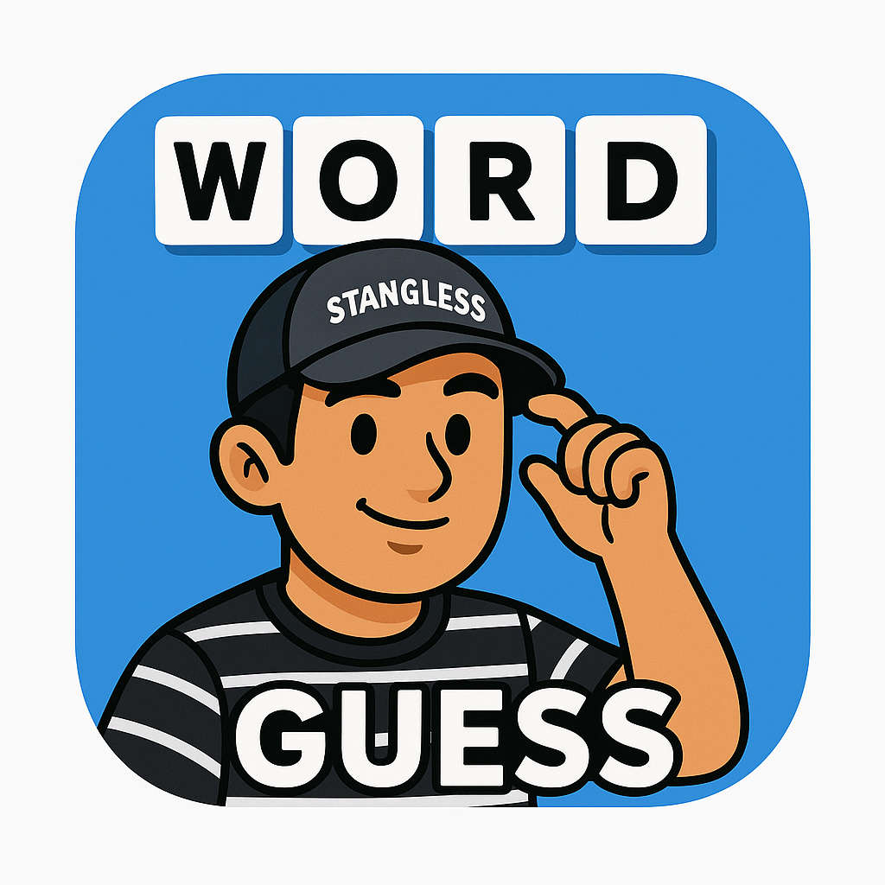

# Word Guess Game

เกมทายคำภาษาไทยที่พัฒนาด้วย ASP.NET Core และ Entity Framework สำหรับวิชา Web Application Development with C# .Net Core Framework ปี 3

<div align="center">
  <a href="https://wordguessgame.fly.dev/" target="_blank">
    
    <br/>
    <h3>WordGuessGame</h3>
    <p><em>คลิกเพื่อเล่นเกม</em></p>
  </a>
</div>

## ภาพรวมโปรเจค

โปรเจคนี้เป็นเว็บแอปพลิเคชันเกมทายคำที่ใช้:

- **ASP.NET Core 8.0** - Framework หลักสำหรับพัฒนาเว็บแอปพลิเคชัน
- **Entity Framework Core** - ORM สำหรับจัดการฐานข้อมูล
- **SQLite** - ฐานข้อมูลสำหรับเก็บข้อมูลเกม
- **ASP.NET Core Identity** - ระบบจัดการผู้ใช้และการยืนยันตัวตน
- **Razor Pages** - สำหรับสร้าง UI และการจัดการหน้าเว็บ
- **Bootstrap** - Framework CSS สำหรับการออกแบบ UI
- **Docker** - สำหรับ containerization และ deployment
- **Fly.io** - Cloud platform สำหรับ hosting

## ฟีเจอร์หลัก

🎮 **ระบบเกมทายคำ** - เล่นเกมทายคำในหมวดหมู่ต่างๆ พร้อมระบบจับเวลา

🏆 **ระบบคะแนน** - บันทึกคะแนนและแสดงตารางอันดับผู้เล่น

📚 **หมวดหมู่คำศัพท์** - คำศัพท์แบ่งตามหมวดหมู่ เช่น สัตว์, อาหาร, กีฬา, ภาพยนตร์, เพลง, สถานที่ท่องเที่ยว

🔐 **ระบบสมาชิก** - สมัครสมาชิก เข้าสู่ระบบ และจัดการโปรไฟล์

⏱️ **ระบบจับเวลา** - เกมมีเวลาจำกัด 60 วินาที

🎯 **ระบบคะแนนสูงสุด** - บันทึกเฉพาะคะแนนที่สูงกว่าเดิมในแต่ละหมวดหมู่

👤 **เล่นแบบไม่ล็อกอิน** - สามารถเล่นได้โดยไม่ต้องสมัครสมาชิก

## โครงสร้างโปรเจค

```
WordGuessGame/
├── Models/                   # Data Models
│   ├── Category.cs          # โมเดลหมวดหมู่คำศัพท์
│   ├── Word.cs              # โมเดลคำศัพท์
│   ├── Score.cs             # โมเดลคะแนนผู้เล่น
│   └── GameState.cs         # โมเดลสถานะเกม
├── Data/                    # Database Context และ Migrations
│   ├── ApplicationDbContext.cs
│   ├── SeedData.cs          # ข้อมูลเริ่มต้น
│   └── Migrations/          # Database migrations
├── Services/                # Business Logic Services
│   └── GameService.cs       # Service จัดการเกม
├── Pages/                   # Razor Pages
│   ├── Index.cshtml         # หน้าแรก
│   ├── Category.cshtml      # เลือกหมวดหมู่
│   ├── Gameplay.cshtml      # หน้าเล่นเกม
│   ├── Leaderboard.cshtml   # ตารางคะแนน
│   ├── Profile.cshtml       # โปรไฟล์ผู้ใช้
│   ├── Login.cshtml         # เข้าสู่ระบบ
│   ├── Register.cshtml      # สมัครสมาชิก
│   └── HowToPlay.cshtml     # วิธีการเล่น
├── wwwroot/                 # Static files
│   ├── css/                 # Stylesheets
│   ├── js/                  # JavaScript files
│   └── image/               # รูปภาพ
├── Dockerfile               # Docker configuration
├── fly.toml                 # Fly.io deployment config
└── Program.cs               # Application entry point
```

## การติดตั้งและรันโปรแกรม

### ข้อกำหนดระบบ

- .NET 8.0 SDK หรือสูงกว่า
- Visual Studio 2022 หรือ Visual Studio Code
- SQLite (รวมอยู่ใน .NET SDK)
- Docker (สำหรับ deployment)

### วิธีการติดตั้ง

1. **Clone repository นี้**
   ```bash
   git clone https://github.com/Anuchit-m/WordGuessGame.git
   cd WordGuessGame
   ```

2. **Restore dependencies**
   ```bash
   dotnet restore
   ```

3. **สร้างฐานข้อมูล**
   ```bash
   dotnet ef database update
   ```

4. **รันโปรเจค**
   ```bash
   dotnet run
   ```

5. **เปิดเว็บเบราว์เซอร์**
   ```
   https://localhost:7000
   หรือ
   http://localhost:5000
   ```

## การ Deploy ด้วย Docker

### Build Docker Image

```bash
docker build -t wordguessgame .
```

### Run Docker Container

```bash
docker run -p 8080:8080 wordguessgame
```

## การ Deploy บน Fly.io

โปรเจคนี้ได้ถูก deploy แล้วที่: **https://wordguessgame.fly.dev/**

### วิธี Deploy

1. **ติดตั้ง Fly CLI**
   ```bash
   # Windows
   iwr https://fly.io/install.ps1 -useb | iex
   
   # macOS/Linux
   curl -L https://fly.io/install.sh | sh
   ```

2. **Login และ Deploy**
   ```bash
   fly auth login
   fly deploy
   ```

## วิธีการใช้งาน

### 1. เริ่มต้นใช้งาน
- เข้าสู่เว็บไซต์และเลือก "เล่นโดยไม่ต้องเข้าสู่ระบบ" หรือสมัครสมาชิก
- หากต้องการบันทึกคะแนน ให้สมัครสมาชิกและเข้าสู่ระบบ

### 2. เลือกหมวดหมู่
- เลือกหมวดหมู่คำศัพท์ที่ต้องการเล่น
- แต่ละหมวดหมู่มีคำศัพท์ที่แตกต่างกัน

### 3. เล่นเกม
- เกมจะแสดงคำใบ้และให้ทายคำศัพท์
- มีเวลา 60 วินาทีในการทายคำ
- ทายถูก 1 คำ ได้ 10 คะแนน
- เกมจะจบเมื่อหมดเวลาหรือทายคำครบทุกคำในหมวดหมู่

### 4. ดูคะแนน
- ดูคะแนนของตัวเองในหน้า Profile
- ดูตารางอันดับในหน้า Leaderboard

## ฐานข้อมูล

### โครงสร้างตาราง

- **Categories** - หมวดหมู่คำศัพท์
- **Words** - คำศัพท์ในแต่ละหมวดหมู่
- **Scores** - คะแนนผู้เล่น
- **AspNetUsers** - ข้อมูลผู้ใช้ (ASP.NET Identity)

### ข้อมูลเริ่มต้น

ระบบจะสร้างข้อมูลเริ่มต้น 6 หมวดหมู่:
- 🐘 สัตว์ (8 คำ)
- 🍜 อาหาร (8 คำ)
- ⚽ กีฬา (8 คำ)
- 🎬 ภาพยนตร์ (8 คำ)
- 🎵 เพลง (8 คำ)
- 🏝️ สถานที่ท่องเที่ยว (8 คำ)

## เทคโนโลยีที่ใช้

### Backend
- **ASP.NET Core 8.0** - Web framework
- **Entity Framework Core** - ORM
- **SQLite** - Database
- **ASP.NET Core Identity** - Authentication & Authorization

### Frontend
- **Razor Pages** - Server-side rendering
- **Bootstrap 5** - CSS framework
- **JavaScript** - Client-side interactions
- **jQuery** - DOM manipulation

### DevOps
- **Docker** - Containerization
- **Fly.io** - Cloud hosting
- **GitHub** - Version control

## ฟีเจอร์ที่พัฒนาแล้ว

✅ **ระบบผู้ใช้**
- สมัครสมาชิก
- เข้าสู่ระบบ/ออกจากระบบ
- จัดการโปรไฟล์
- เล่นแบบไม่ล็อกอิน

✅ **ระบบเกม**
- เลือกหมวดหมู่
- เล่นเกมทายคำ
- ระบบจับเวลา 60 วินาที
- คำนวณคะแนน

✅ **ระบบคะแนน**
- บันทึกคะแนนสูงสุด
- ตารางอันดับ
- ประวัติคะแนนส่วนตัว

✅ **ระบบข้อมูล**
- จัดการหมวดหมู่และคำศัพท์
- ข้อมูลเริ่มต้น (Seed Data)
- Database migrations

✅ **UI/UX**
- Responsive design
- Modern UI ด้วย Bootstrap
- การนำทางที่ใช้งานง่าย

## การพัฒนา

โปรเจคนี้พัฒนาขึ้นในปีการศึกษา 2568 สำหรับวิชา **Web Application Development with C# .Net Core Framework** ปี 3 โดยใช้ความรู้พื้นฐานในการเขียนโปรแกรม C# และการพัฒนาเว็บแอปพลิเคชันด้วย ASP.NET Core Framework

### Architecture Pattern
- **MVC Pattern** - Model-View-Controller
- **Repository Pattern** - Data access abstraction
- **Dependency Injection** - Service management
- **Session Management** - Game state handling


## หมายเหตุ

- โปรเจคนี้เป็นโปรเจคการศึกษา ไม่ได้ออกแบบสำหรับการใช้งานจริงในองค์กร
- ข้อมูลจะถูกเก็บใน SQLite database
- ระบบล็อกอินใช้ ASP.NET Core Identity
- รองรับการเล่นแบบไม่ล็อกอิน (ไม่บันทึกคะแนน)
- Deploy บน Fly.io cloud platform

## ผู้พัฒนา

**นาย อนุชิต มูลทองคำ**
- ปีการศึกษา: 2568
- มหาวิทยาลัยเทคโนโลยีมหานคร
- วิชา: Web Application Development with C# .Net Core Framework

## Links

- 🌐 **Live Demo**: https://wordguessgame.fly.dev/

---

## License

โปรเจคนี้สร้างขึ้นเพื่อการศึกษา สามารถนำไปใช้และพัฒนาต่อได้ตามต้องการ

---

